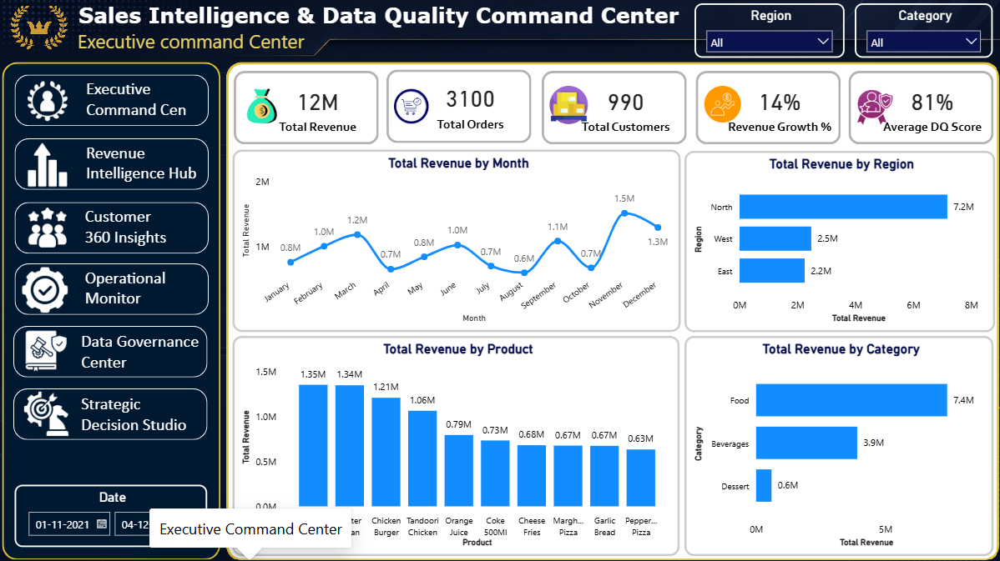
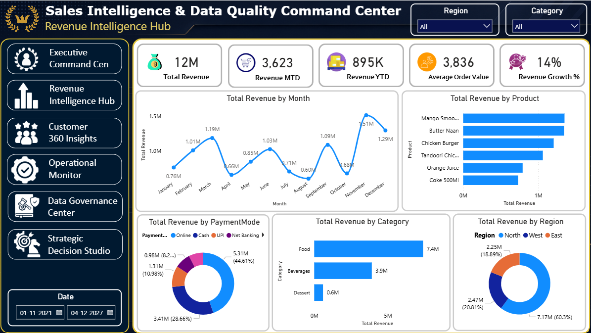
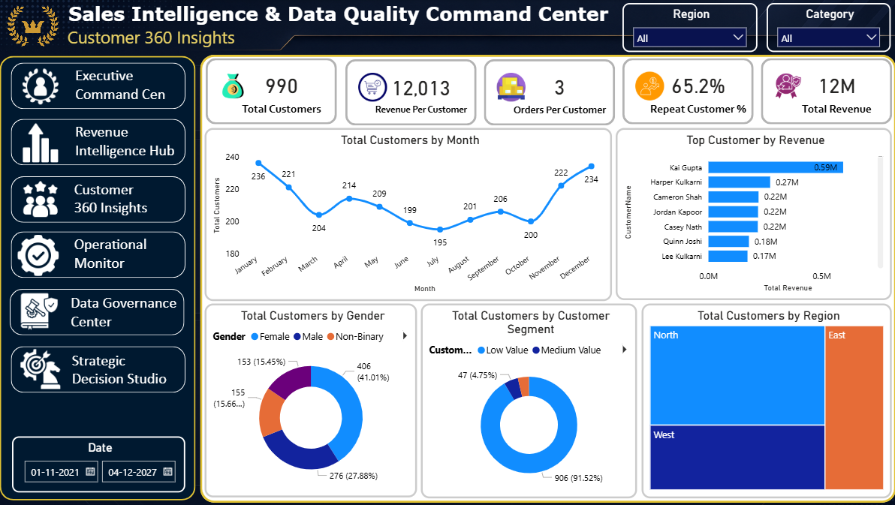
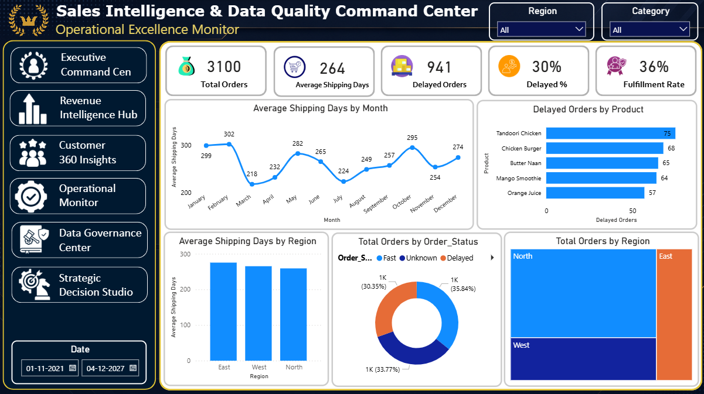
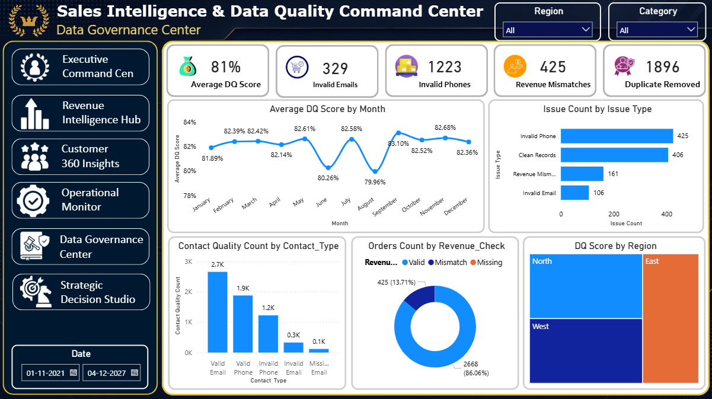
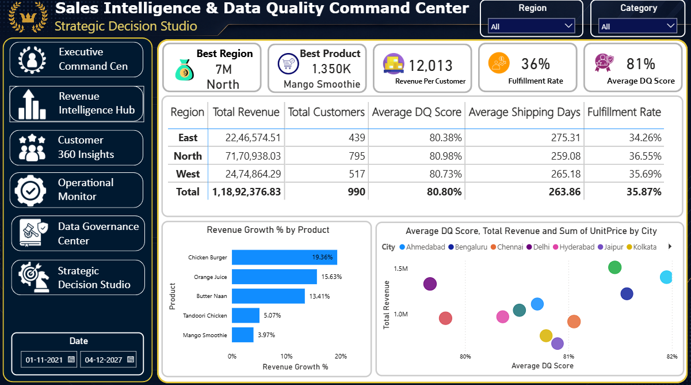

# <h1 align="center">SalesNexus: Performance & Quality Analytics</h1>

<p align="center">
  <b>Interactive Power BI dashboard for sales performance, customer analytics, operational monitoring, and data quality analysis.</b>
</p>

<p align="center">
  
  
  
  
  
</p>

---

## 📌 Project Overview

**SalesNexus: Performance & Quality Analytics** is an interactive Power BI business intelligence project designed to provide a consolidated view of sales performance, customer behavior, operational efficiency, and data quality.

The dashboard combines key performance indicators, trend analysis, regional comparisons, customer segmentation, operational metrics, and data quality monitoring into a multi-page analytical report.

The primary objective is to transform raw sales data into meaningful business insights that can support performance monitoring and data-driven decision-making.

---

## 🎯 Business Problem

Businesses often work with sales and operational data distributed across multiple areas, making it difficult to obtain a consistent view of performance.

Common challenges include:

* Limited visibility into revenue performance
* Difficulty identifying high-value customers
* Lack of regional and product-level comparisons
* Operational delays affecting fulfillment
* Incomplete or invalid customer information
* Duplicate or inconsistent records
* Revenue validation issues
* Limited visibility into overall data quality

This project addresses these areas through a centralized Power BI reporting solution.

---

## 🚀 Project Objectives

The dashboard is designed to:

* Monitor overall sales performance
* Analyze revenue trends and growth
* Identify high-performing products and regions
* Understand customer behavior and segmentation
* Monitor shipping and fulfillment performance
* Track data quality indicators
* Identify potential data inconsistencies
* Provide KPI-driven business insights
* Support management-level decision-making

---

# 📊 Dashboard Structure

The report contains six analytical pages.

---

## 01. Executive Overview

Provides a high-level summary of overall business performance.

### Key KPIs

* Total Revenue
* Total Orders
* Total Customers
* Revenue Growth %
* Average Data Quality Score

### Analysis

* Revenue trend
* Product performance
* Regional revenue
* Category contribution
* Executive KPI summary

---

## 02. Revenue Insights

Focuses on revenue performance across time, products, categories, payment methods, and regions.

### Key KPIs

* Total Revenue
* Revenue MTD
* Revenue YTD
* Average Order Value
* Revenue Growth %

### Analysis

* Monthly revenue trend
* Revenue by product
* Revenue by category
* Revenue by payment mode
* Revenue by region

---

## 03. Customer Analytics

Provides a 360-degree view of customer activity and segmentation.

### Key KPIs

* Total Customers
* Revenue per Customer
* Orders per Customer
* Repeat Customer %
* Total Revenue

### Analysis

* Customer acquisition trend
* Top customers
* Customer segmentation
* Customer distribution by gender
* Regional customer distribution

---

## 04. Operational Performance

Monitors order fulfillment, shipping performance, and operational delays.

### Key KPIs

* Total Orders
* Average Shipping Days
* Delayed Orders
* Delayed %
* Fulfillment Rate

### Analysis

* Shipping trend
* Delayed orders by product
* Order status distribution
* Regional operational performance

---

## 05. Data Quality Monitor

Provides visibility into data integrity and potential quality issues.

### Key KPIs

* Average Data Quality Score
* Invalid Emails
* Invalid Phones
* Revenue Mismatches
* Duplicate Records

### Analysis

* Data quality trend
* Issue type analysis
* Contact data validation
* Revenue validation
* Regional data quality

---

## 06. Business Insights

Combines important business indicators to support strategic analysis.

### Key KPIs

* Best Performing Region
* Best Performing Product
* Average Revenue per Customer
* Fulfillment Rate
* Average Data Quality Score

### Analysis

* Regional performance comparison
* Product performance
* Strategic KPI comparison
* Revenue vs. data quality analysis

---

# 📈 Key Performance Indicators

| KPI                        | Business Purpose                       |
| -------------------------- | -------------------------------------- |
| Total Revenue              | Measures total revenue generated       |
| Total Orders               | Measures sales order volume            |
| Total Customers            | Measures customer base                 |
| Revenue Growth %           | Tracks revenue change over time        |
| Revenue MTD                | Measures month-to-date revenue         |
| Revenue YTD                | Measures year-to-date revenue          |
| Average Order Value        | Measures average transaction value     |
| Repeat Customer %          | Indicates repeat customer activity     |
| Average Shipping Days      | Measures shipping efficiency           |
| Delayed Orders             | Tracks late orders                     |
| Fulfillment Rate           | Measures order fulfillment performance |
| Average Data Quality Score | Measures overall data quality          |
| Invalid Emails             | Identifies invalid email records       |
| Invalid Phones             | Identifies invalid phone records       |
| Revenue Mismatches         | Identifies revenue validation issues   |

---

# 💡 Business Insights

## Revenue

* Total revenue exceeds 12 million within the simulated dataset.
* Food is the highest-contributing product category.
* The North region demonstrates strong revenue performance.
* Product-level analysis highlights key contributors to overall sales.

## Customer

* Repeat customer activity exceeds 65%.
* A relatively small group of customers contributes a significant portion of revenue.
* Regional customer distribution highlights potential market opportunities.

## Operations

* Delayed orders affect overall fulfillment performance.
* Shipping performance varies across regions and products.
* Delay monitoring can help identify areas for operational improvement.

## Data Quality

* The overall data quality score remains above 80%.
* Invalid phone records represent a major data quality issue.
* Revenue validation identifies records requiring further investigation.
* Data quality monitoring provides greater visibility into data integrity.

> **Note:** Business metrics and insights are based on the simulated dataset included in this repository.

---

# 🗂️ Dataset

The project uses a simulated sales dataset containing transactional, customer, product, regional, operational, and data-quality information.

### Dataset Characteristics

* ~3,100 sales orders
* ~990 customers
* Multiple product categories
* Multiple regions
* Customer segmentation
* Revenue metrics
* Operational metrics
* Data quality indicators

---

# 🛠️ Tools & Technologies

### Business Intelligence

* **Microsoft Power BI Desktop**
* Power BI Report Development
* Interactive Data Visualization

### Data Preparation

* **Power Query**
* Data Cleaning
* Data Transformation
* Data Validation

### Analytics

* **DAX**
* KPI Development
* Time-Based Analysis
* Business Metrics

### Data Modeling

* Star Schema concepts
* Relationships
* Measures
* Dimension and fact analysis

### Version Control

* **Git**
* **GitHub**

---

# 📁 Repository Structure

```text
SalesNexus-Performance-Quality-Analytics/
│
├── .gitignore
├── README.md
│
├── 01_raw_data/
│   └── sales_messy_dataset.csv
│
├── 02_powerbi_report/
│   └── SalesNexus_Performance_Quality_Analytics.pbix
│
├── 03_documentation/
│   └── Business_Requirements_&_Data_Dictionary.txt
│
└── assets/
    ├── executive_overview.png
    ├── revenue_insights.png
    ├── customer_analytics.png
    ├── operational_performance.png
    ├── data_quality_monitor.png
    └── business_insights.png
```

---

# 🖼️ Dashboard Preview

## Executive Overview



## Revenue Insights



## Customer Analytics



## Operational Performance



## Data Quality Monitor



## Business Insights



---

# 👤 Author

### Marmika Pimparkar

Business Analytics | Power BI | Data Analysis | Business Intelligence


🤝 Connect With Me

<p align="left"> <a href="https://www.linkedin.com/in/marmika-pimparkar-65865a277">  </a> <a href="mailto:marmikapimparkar@gmail.com">  </a> <a href="https://github.com/marmikapimparkar">  </a> </p>


---

⭐ Thanks for visiting my profile!

Explore my repositories and feel free to connect with me. 🚀

</p>
<p align="center">
  <b>Built with Power BI • DAX • Power Query • Data Modeling</b>
</p>
